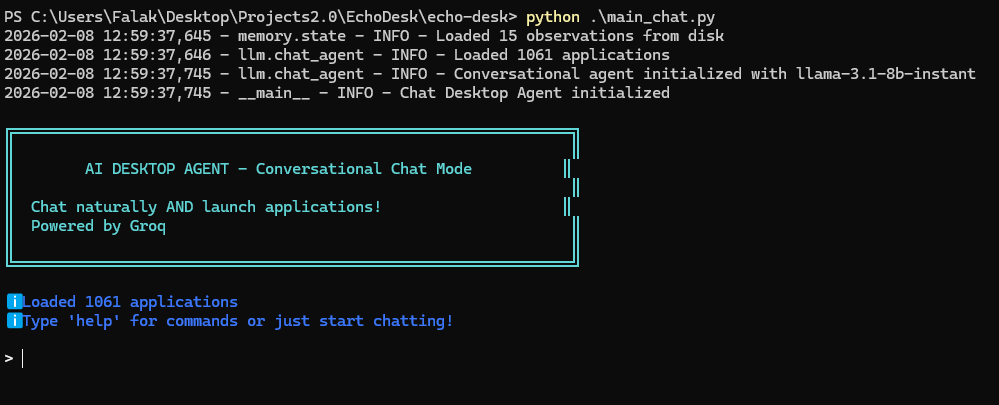

# AI Desktop Agent - Security-First Edition

A **security-first Windows Desktop AI Agent** that uses natural language to launch applications. Built with a strict separation between application discovery (Phase 1) and agentic execution (Phase 2).



## 🔒 Security Philosophy: The Binary Boundary

This project implements a **"Safety by Design"** architecture that fundamentally separates two critical concerns:

### Phase 1: Bootstrap (Deterministic Scanning)
- **What**: One-time system scan to discover installed applications
- **How**: Pure deterministic logic using Windows APIs
- **Security**: NO LLM, NO execution, NO network requests
- **Output**: `config/app_registry.json` (read-only whitelist)

### Phase 2: AI Agent Runtime
- **What**: Natural language interface for launching applications
- **How**: LLM interprets intent → Policy maps to app → Registry validates → Executor launches
- **Security**: LLM NEVER sees paths/commands, Executor ONLY receives validated paths
- **Input**: Natural language text ONLY

## 🏗️ Architecture

```
┌─────────────────────────────────────────────────────────────────┐
│                         USER INPUT                              │
│                  "I want to write notes"                        │
└────────────────────────────┬────────────────────────────────────┘
                             │
                             ▼
┌─────────────────────────────────────────────────────────────────┐
│                   LLM INTERPRETER                               │
│  • Input: Raw natural language                                 │
│  • Output: {"goal": "write_text", "confidence": 0.9}           │
│  • NEVER sees: paths, executables, commands                    │
└────────────────────────────┬────────────────────────────────────┘
                             │
                             ▼
┌─────────────────────────────────────────────────────────────────┐
│                   POLICY DECISION                               │
│  • Input: Structured goal ("write_text")                       │
│  • Output: App name ("notepad")                                │
│  • NEVER sees: paths, user input                               │
└────────────────────────────┬────────────────────────────────────┘
                             │
                             ▼
┌─────────────────────────────────────────────────────────────────┐
│                   REGISTRY VALIDATOR                            │
│  • Input: App name ("notepad")                                 │
│  • Output: Validated path ("C:\Windows\...\notepad.exe")      │
│  • Source: app_registry.json (read-only)                       │
└────────────────────────────┬────────────────────────────────────┘
                             │
                             ▼
┌─────────────────────────────────────────────────────────────────┐
│                   SAFE EXECUTOR                                 │
│  • Input: Validated path ONLY                                  │
│  • Method: subprocess.Popen([path], shell=False)               │
│  • NEVER receives: user input, dynamic arguments               │
└────────────────────────────┬────────────────────────────────────┘
                             │
                             ▼
┌─────────────────────────────────────────────────────────────────┐
│                    APPLICATION LAUNCHES                         │
│                   ✓ Success message                             │
└─────────────────────────────────────────────────────────────────┘
```

## 📁 Project Structure

```
ai_desktop_agent/
├── tools/
│   ├── __init__.py
│   └── bootstrap_scan.py      # Phase 1: One-time discovery (NO LLM)
├── config/
│   ├── app_registry.json      # Generated whitelist (Read-only for Agent)
│   └── memory.json            # Agent memory (auto-generated)
├── llm/
│   ├── __init__.py
│   └── interpreter.py         # Natural language → Structured Goal
├── policy/
│   ├── __init__.py
│   └── decision.py            # Goal → Allowed App mapping
├── memory/
│   ├── __init__.py
│   └── state.py               # Observation & context tracking
├── system/
│   ├── __init__.py
│   └── executor.py            # Safe subprocess execution
├── ui/
│   ├── __init__.py
│   └── cli.py                 # User interaction layer
├── main.py                    # Agent entry point
└── README.md                  # This file
```

## 🚀 Quick Start

### Step 1: Run Bootstrap Scan (Phase 1)

**IMPORTANT**: This must be run FIRST to generate the application registry.

```powershell
cd ai_desktop_agent
python -m tools.bootstrap_scan
```

This will:
- Scan `Program Files`, `Program Files (x86)`, and `AppData\Local\Programs`
- Filter out installers, updaters, and background services
- Generate `config/app_registry.json` with discovered applications

### Step 2: Run the AI Agent (Phase 2)

```powershell
python main.py
```

Or in dry-run mode (simulates execution without launching apps):

```powershell
python main.py --dry-run
```

### Step 3: Use Natural Language

```
> I want to write notes
  Goal: write_text (confidence: 90%)
✓ Successfully launched: notepad.exe

> open chrome
  Goal: launch_chrome (confidence: 95%)
✓ Successfully launched: chrome.exe

> help
[Shows available commands]

> list
[Shows all discovered applications]

> stats
[Shows agent statistics]

> exit
```

## 🛡️ Security Features

### 1. No Self-Scrutiny
- The agent **NEVER** scans the system at runtime
- It only trusts the pre-generated `app_registry.json`
- The registry is **read-only** during agent execution

### 2. LLM Isolation
- The LLM **NEVER** sees:
  - File paths
  - Executable names
  - System commands
  - Registry contents
- The LLM **ONLY** sees natural language and returns structured goals

### 3. Confidence Threshold
- Minimum confidence: **70%** (configurable in `main.py`)
- Low-confidence interpretations are rejected
- User is prompted to be more specific

### 4. No Shell Execution
- Uses `subprocess.Popen([path], shell=False)` exclusively
- **NEVER** uses `shell=True`
- **NEVER** accepts dynamic arguments
- Prevents command injection attacks

### 5. Whitelist-Only Execution
- Only applications in `app_registry.json` can be launched
- No dynamic path construction
- No user input in executable paths

### 6. Defense in Depth
Multiple security layers:
1. **Input Validation**: Checks for empty/malformed input
2. **LLM Interpretation**: Extracts structured goals only
3. **Policy Mapping**: Maps goals to known app names
4. **Registry Validation**: Verifies app exists in whitelist
5. **Path Validation**: Checks path exists and is executable
6. **Safe Execution**: Uses subprocess with shell=False

## 🎯 Threat Model

### What This Prevents

✅ **Prompt Injection Attacks**
- Even if a user tries `"open notepad && del /f /q *"`, the LLM only extracts `"notepad"`
- The executor receives only the validated path from the registry
- Shell commands are never executed

✅ **Arbitrary Code Execution**
- Only whitelisted applications can be launched
- No dynamic path construction
- No shell access

✅ **Path Traversal**
- All paths come from the registry (absolute paths only)
- No user input in paths
- No relative path resolution

✅ **Malicious Application Discovery**
- Bootstrap scan filters out installers, updaters, and background services
- Only user-facing applications are whitelisted

### What This Does NOT Prevent

❌ **Malicious Applications in Registry**
- If a malicious app is installed and passes the bootstrap filter, it will be in the registry
- Solution: Review `app_registry.json` after bootstrap scan

❌ **Social Engineering**
- If a user explicitly asks to launch a malicious app by name, the agent will comply
- Solution: User awareness and registry auditing

❌ **Application-Level Vulnerabilities**
- The agent launches applications safely, but cannot prevent vulnerabilities in those applications
- Solution: Keep applications updated

## 📊 Agent Memory

The agent maintains memory of interactions in `config/memory.json`:

- **Observations**: Records each interaction (input, goal, app, success/failure)
- **Statistics**: Tracks success rate, confidence scores, most-used apps
- **Context**: Provides context for future interactions (future enhancement)

View memory stats:
```
> stats
```

Clear memory:
```
> clear
```

## 🔧 Configuration

### Adjusting Confidence Threshold

Edit `main.py`:
```python
class AIDesktopAgent:
    MIN_CONFIDENCE = 0.70  # Change this value (0.0 to 1.0)
```

### Adding Custom Policy Mappings

Edit `policy/decision.py`:
```python
GOAL_TO_APP_POLICY = {
    'write_text': ['notepad', 'notepadplusplus', 'vscode'],
    'your_custom_goal': ['your_app_name'],
    # ...
}
```

### Refreshing Application Registry

Re-run the bootstrap scan:
```powershell
python -m tools.bootstrap_scan
```

This will regenerate `config/app_registry.json` with current applications.

## 🧪 Testing

### Test Individual Modules

Each module can be tested independently:

```powershell
# Test bootstrap scanner
python -m tools.bootstrap_scan

# Test LLM interpreter
python -m llm.interpreter

# Test policy engine
python -m policy.decision

# Test executor (dry run)
python -m system.executor

# Test memory
python -m memory.state

# Test CLI
python -m ui.cli
```

### Test Full Agent in Dry Run Mode

```powershell
python main.py --dry-run
```

This simulates execution without actually launching applications.

## 📝 Logging

Logs are written to `agent.log` with the following information:
- User inputs
- LLM interpretations
- Policy decisions
- Registry validations
- Execution results
- Errors and warnings

## 🤝 Contributing

When contributing, please maintain the security architecture:

1. **Never** allow the LLM to see paths or commands
2. **Never** use `shell=True` in subprocess calls
3. **Never** accept user input in executable paths
4. **Always** validate against the registry
5. **Always** use absolute paths

## 📄 License

[Your License Here]

## 🙏 Acknowledgments

Built with security as the primary design constraint, inspired by:
- Principle of Least Privilege
- Defense in Depth
- Separation of Concerns
- Fail-Safe Defaults

---

## 🔍 FAQ

**Q: Why separate bootstrap scanning from the agent?**  
A: This enforces the "Binary Boundary" - the agent never scans the system, preventing it from discovering or executing arbitrary files at runtime.

**Q: Can I add applications manually to the registry?**  
A: Yes! Edit `config/app_registry.json` and add entries in the format:
```json
{
  "applications": {
    "myapp": "C:\\Path\\To\\MyApp.exe"
  }
}
```

**Q: Why doesn't the LLM see application names?**  
A: To prevent prompt injection. If the LLM saw app names, a malicious prompt could trick it into suggesting dangerous applications.

**Q: Can the agent pass arguments to applications?**  
A: No, by design. This prevents command injection. The agent only launches applications without arguments.

**Q: How do I update the application list?**  
A: Re-run the bootstrap scan: `python -m tools.bootstrap_scan`

**Q: Is this safe for production use?**  
A: This is a security-focused design, but you should:
- Review the generated `app_registry.json`
- Test in dry-run mode first
- Monitor `agent.log` for suspicious activity
- Keep the registry minimal (only apps you need)

---

**Built with Security by Design** 🔒
